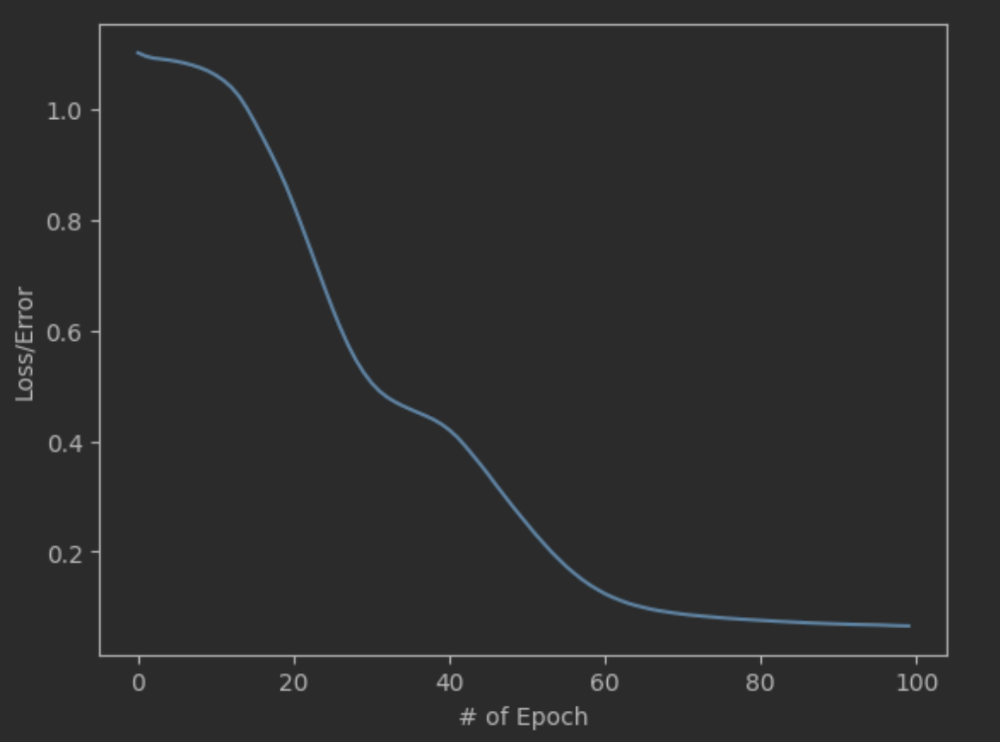
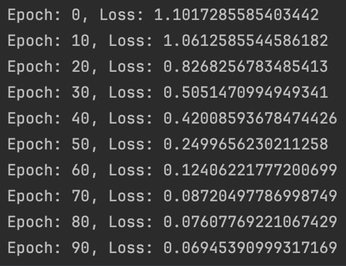
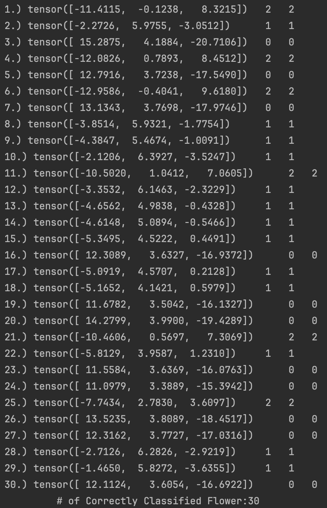

# Machine Learning Classifying Types of Iris Flowers
# Overview
This dataset contains three types of Iris flowers, with 50 samples of each type. I built a neural network using PyTorch, leveraging NumPy, Pandas, Matplotlib, and Scikit-Learn for data preprocessing, visualization, and evaluation. The model takes four inputs—Sepal Length, Sepal Width, Petal Length, and Petal Width—helping me gain a deeper understanding of how machine learning models are built and trained.
___
# Setting up the Model & Data Processing
Initializing Arguments: Defined the input layer, number of hidden layers, neurons per hidden layer, and output layer  

Loading Data: Imported the dataset from a CSV file  

Processing: Separated inputs(X) & outputs(y) + label-encoded types of Iris 'Iris-setosa' → 0.0, 'Iris-versicolor' → 1.0, 'Iris-virginica' → 2.0  

Training/Testing: Split the dataset randomly into training data and testing data  

Minimizaing Loss: Compared predicted outputs with actual values, set the learning rate, and applied backpropagation with gradient descent to optimize the model  

Visualization: Plotted the loss function to monitor and ensure it decreases over time  

Testing Data: Turned off backpropagation and then used the testing data to evaluate the model
___
# The Loss Function Graph:  

# The Training Progress Log:  

# Test Results

# Data Source
___
In the Repository named "iris_dataset.csv"

# Note to self (What I learned)
___
- initializing arguments and moving the neural network move forward  
- pre-activation function(fully connected linear transformation)  
- post-activation applies after the output of the pre-activation function (ReLu)  
- using .unique() to get unique elements in a column  
- train_test_split from sklearn allows to use the data set and split it into training and testing by putting a percentage
- Convert into tensor FloatTensor() and LongTensor()  
- nn.CrossEntropyLoss() to find how far us is the predicted data ((1/n)* E(y_real_training - y_predicted)^2)  
- Adam optimizer and setting up the lr  
- setting up backprogation w/ .backward()
- Turning off backpropagation
- Evaulated the model to see what kind of score  it got
  
